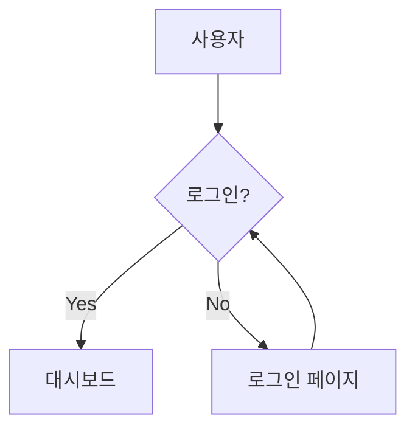

# 모범 사례 및 팁

## 📝 문서 작성 모범 사례

### 1. 명확하고 일관된 구조

```markdown
# 페이지 제목 (H1은 페이지당 하나만)

## 주요 섹션 (H2)

### 하위 섹션 (H3)

#### 세부 항목 (H4는 필요한 경우에만)
```

**좋은 예:**
```markdown
# API 가이드

## 인증

### 토큰 기반 인증

### OAuth 인증

## 엔드포인트

### 사용자 관리

#### 사용자 생성
#### 사용자 조회
```

### 2. 의미 있는 파일명 사용

**좋은 파일명:**
```
installation.md
getting-started.md
user-management.md
api-reference.md
```

**피해야 할 파일명:**
```
page1.md
문서.md
how_to_do_something_really_long.md
```

### 3. 페이지 간 논리적 연결

```yaml
nav:
  - 시작하기:
    - 소개: index.md
    - 설치: installation.md
    - 첫 번째 프로젝트: first-project.md
  - 가이드:
    - 기본 사용법: basic-usage.md
    - 고급 기능: advanced-features.md
  - 참조:
    - API 문서: api.md
    - CLI 명령어: cli.md
```

## 🎨 콘텐츠 디자인

### 1. 시각적 요소 활용

**아이콘과 이모지 사용:**
```markdown
## 🚀 시작하기

### ⚡ 빠른 설치

### 🔧 설정

### 📝 첫 번째 문서 작성
```

**콜아웃 박스 활용:**
```markdown
!!! note "참고"
    이것은 중요한 참고 사항입니다.

!!! warning "경고"
    주의해서 사용해야 하는 기능입니다.

!!! tip "팁"
    더 효율적인 방법이 있습니다.
```

### 2. 코드 예제 최적화

**언어 명시:**
```markdown
```python
def hello_world():
    print("Hello, World!")
```

```yaml
site_name: My Docs
theme:
  name: material
```

**제목과 함께:**
```markdown
```python title="main.py"
#!/usr/bin/env python3
def main():
    print("Hello from main!")

if __name__ == "__main__":
    main()
```

### 3. 이미지와 다이어그램

**적절한 이미지 크기:**
```markdown
{ width="600" }
```

**Mermaid 다이어그램 활용:**
```markdown


## 🔍 검색 최적화

### 1. 검색 친화적 제목 작성

**좋은 예:**
- "Python 환경 설정하기"
- "GitHub Actions로 자동 배포"
- "Material 테마 커스터마이징"

**개선이 필요한 예:**
- "설정"
- "배포"
- "커스텀"

### 2. 메타데이터 활용

```markdown
---
title: Python 개발 환경 설정
description: MkDocs 프로젝트를 위한 Python 개발 환경 설정 방법
tags:
  - python
  - setup
  - development
---

# Python 개발 환경 설정
```

### 3. 검색 설정 최적화

```yaml
plugins:
  - search:
      lang: ko
      separator: '[\s\-\.]+'
      prebuild_index: true
```

## 🚀 성능 최적화

### 1. 이미지 최적화

**WebP 형식 사용:**
```markdown

```

**적절한 크기 지정:**
```markdown
{ width="200" height="100" }
```

### 2. 불필요한 플러그인 제거

```yaml
plugins:
  # 필수만 사용
  - search:
      lang: ko
  # - git-revision-date-localized  # 필요한 경우에만
  # - minify                       # 프로덕션에서만
```

### 3. CSS/JS 최적화

```yaml
theme:
  name: material
  features:
    - navigation.instant    # 빠른 로딩
    - navigation.top       # 맨 위로 버튼
  custom_dir: overrides/   # 필요한 경우에만
```

## 🔄 유지보수성

### 1. 정기적인 콘텐츠 업데이트

**날짜 정보 포함:**
```markdown
!!! info "업데이트 정보"
    이 문서는 2024년 1월에 마지막으로 업데이트되었습니다.
```

**자동 업데이트 날짜:**
```yaml
plugins:
  - git-revision-date-localized:
      type: date
      locale: ko
```

### 2. 링크 관리

**상대 경로 사용:**
```markdown
[설치 가이드](../installation.md)
[API 문서](api.md#authentication)
```

**외부 링크 표시:**
```markdown
[GitHub 저장소](https://github.com/user/repo){ target="_blank" }
```

### 3. 템플릿 활용

**재사용 가능한 콘텐츠:**
```markdown
<!-- includes/installation-note.md -->
!!! warning "시스템 요구사항"
    - Python 3.7 이상
    - pip 패키지 관리자
    - Git (선택사항)
```

사용:
```markdown
--8<-- "includes/installation-note.md"
```

## 📊 분석과 모니터링

### 1. Google Analytics 설정

```yaml
theme:
  name: material
extra:
  analytics:
    provider: google
    property: G-XXXXXXXXXX
```

### 2. 사용자 피드백 수집

```markdown
---
feedback: true
---

# 문서 제목

콘텐츠...

---

이 문서가 도움이 되었나요? 
[피드백 보내기](mailto:feedback@example.com)
```

## 🔒 보안 고려사항

### 1. 민감한 정보 제외

```yaml
# .gitignore
site/
*.pyc
.env
secrets.yml
```

### 2. 외부 링크 보안

```markdown
[외부 사이트](https://example.com){ target="_blank" rel="noopener" }
```

## 📱 접근성과 UX

### 1. 모바일 최적화

```yaml
theme:
  name: material
  features:
    - navigation.tabs
    - navigation.sections
    - navigation.expand
    - navigation.indexes
    - toc.integrate
```

### 2. 다크 모드 지원

```yaml
theme:
  name: material
  palette:
    - media: "(prefers-color-scheme: light)"
      scheme: default
      toggle:
        icon: material/weather-night
        name: 다크 모드로 전환
    - media: "(prefers-color-scheme: dark)"
      scheme: slate
      toggle:
        icon: material/weather-sunny
        name: 라이트 모드로 전환
```

## 🚦 품질 체크리스트

### 배포 전 확인사항

- [ ] 모든 링크가 정상 작동하는가?
- [ ] 이미지가 올바르게 표시되는가?
- [ ] 검색 기능이 작동하는가?
- [ ] 모바일에서 정상 표시되는가?
- [ ] 오타나 문법 오류는 없는가?
- [ ] 네비게이션이 논리적인가?

### 정기 점검 항목

- [ ] 외부 링크 상태 확인
- [ ] 콘텐츠 정확성 검토
- [ ] 사용자 피드백 반영
- [ ] SEO 성능 모니터링
- [ ] 로딩 속도 측정

## 🛠️ 자동화 도구

### 1. 링크 검사 자동화

```python
# link_checker.py
import requests
from bs4 import BeautifulSoup
import sys

def check_links(site_url):
    # 사이트의 모든 링크 검사
    pass

if __name__ == "__main__":
    check_links("http://localhost:8000")
```

### 2. 배포 자동화

```yaml
# .github/workflows/deploy.yml
name: Deploy MkDocs
on:
  push:
    branches: [ main ]
jobs:
  deploy:
    runs-on: ubuntu-latest
    steps:
    - uses: actions/checkout@v2
    - name: Setup Python
      uses: actions/setup-python@v2
      with:
        python-version: 3.x
    - name: Install dependencies
      run: |
        pip install mkdocs-material
    - name: Deploy to GitHub Pages
      run: |
        mkdocs gh-deploy --force
```

이러한 모범 사례를 따르면 유지보수하기 쉽고 사용자 친화적인 문서 사이트를 만들 수 있습니다! 🎉